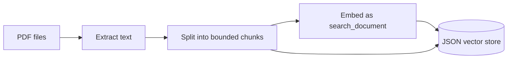
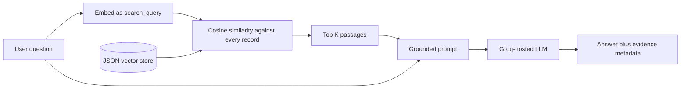

# RAG from scratch: a transparent PDF question-answering pipeline

This repository is an educational implementation of retrieval-augmented generation (RAG) without LangChain, LlamaIndex, or a hosted vector database. It turns PDF documents into searchable vector records, retrieves passages related to a question, and asks a language model to answer from those passages.

The goal is not to hide RAG behind a framework. Every important boundary is visible: configuration, PDF extraction, chunking, embedding, persistence, similarity search, prompt construction, generation, and retrieval evaluation. That makes the project useful to students learning the mechanics and to technical readers evaluating what would need to change before production use.

The included example indexes the *Inception* screenplay. The architecture is document-agnostic, but some prompts and evaluation questions are currently screenplay-specific.

> **Data notice:** a PDF and its generated vector store may contain copyrighted, confidential, or personal text. Only index and distribute material you are authorized to use. See [Security, privacy, and document rights](#security-privacy-and-document-rights) before publishing a fork.

## Contents

- [What this project teaches](#what-this-project-teaches)
- [Current project snapshot](#current-project-snapshot)
- [RAG in plain language](#rag-in-plain-language)
- [Why use RAG?](#why-use-rag)
- [Design principles](#design-principles)
- [Technology choices and tradeoffs](#technology-choices-and-tradeoffs)
- [Repository map](#repository-map)
- [Prerequisites](#prerequisites)
- [Installation](#installation)
- [Configuration reference](#configuration-reference)
- [End-to-end quick start](#end-to-end-quick-start)
- [Implementation walkthrough](#implementation-walkthrough)
- [Modular verification workflow](#modular-verification-workflow)
- [Reproducing the current evaluation](#reproducing-the-current-evaluation)
- [How to tune the pipeline scientifically](#how-to-tune-the-pipeline-scientifically)
- [Important limitations](#important-limitations)
- [Scaling roadmap](#scaling-roadmap)
- [Security, privacy, and document rights](#security-privacy-and-document-rights)
- [Troubleshooting](#troubleshooting)
- [Dependency policy](#dependency-policy)
- [Suggested learning exercises](#suggested-learning-exercises)
- [References and acknowledgments](#references-and-acknowledgments)

## What this project teaches

By following the code module by module, you can learn how to:

- validate configuration and protect API secrets;
- extract text from text-based PDFs;
- divide long documents into bounded, mostly coherent chunks;
- embed documents and questions with the correct retrieval task types;
- implement exact cosine-similarity search with NumPy;
- persist a small vector index in ordinary JSON;
- separate retrieval from answer generation;
- ground an LLM with retrieved evidence;
- test provider integrations without calling external services; and
- measure retrieval independently from generation.

## Current project snapshot

The numbers below describe the checked-in *Inception* example with `CHUNK_SIZE=512`, `TOP_K=5`, and full-size `nomic-embed-text-v1.5` embeddings.

| Property | Observed value |
|---|---:|
| Extracted characters | 163,601 |
| Estimated tokens | 46,333 |
| Stored chunks | 93 |
| Chunk-token range | 343–512 |
| Average chunk size | 497.55 tokens |
| Embedding dimensions | 768 |
| JSON vector-store size | about 2.1 MB |
| Automated unit tests | 76 |
| Retrieval evaluation cases | 5 |
| Current Hit@5 | 80% (4/5) |
| Current mean reciprocal rank | 0.6667 |

These are reproducibility notes, not benchmark claims. The evaluation set is tiny, comes from one document, and uses phrase matching as a relevance proxy. Its results should guide investigation, not justify deployment.

## RAG in plain language

A language model does not automatically know the contents of a private or newly supplied PDF. RAG gives the model selected excerpts at question time:

1. **Retrieval** finds document chunks whose meanings are close to the question.
2. **Augmentation** places those chunks into the model prompt as context.
3. **Generation** produces an answer constrained by that context.

RAG has two distinct flows.

### Indexing flow: prepare knowledge ahead of time



Indexing is relatively expensive but only needs to be repeated when the documents, chunking rules, or embedding model change.

### Question flow: retrieve and answer at runtime



The embedding model runs locally in the default configuration. Answer generation runs through Groq and therefore requires an API key and network access.

## Why use RAG?

RAG is useful when knowledge changes, must be traceable to documents, or should not be baked permanently into a model.

| Approach | Strength | Main limitation | When it fits |
|---|---|---|---|
| RAG | Updates knowledge by rebuilding an index; can expose evidence | Retrieval can miss the necessary passage; the LLM can still misuse context | Document Q&A, internal knowledge, support content |
| Fine-tuning | Changes behavior, style, and task habits | Poor mechanism for storing exact changing facts; training costs and data preparation | Repeated behavior or domain-format adaptation |
| Put the whole document in the prompt | Simplest conceptual path | Cost, latency, context limits, and attention dilution grow with document size | Small documents or prototypes |
| Keyword search | Cheap and explainable | Misses paraphrases and semantic similarity | Exact names, codes, identifiers, legal clauses |
| Hybrid search | Combines lexical precision with semantic recall | More components and ranking logic | Production search where both names and concepts matter |

RAG does not make answers automatically correct. It changes the problem into two observable questions: **did retrieval find useful evidence, and did generation use that evidence faithfully?** This repository evaluates the first question directly and leaves room for a future answer-quality evaluation.

## Design principles

The implementation follows a few deliberate principles:

- **Small modules:** each stage can be read, run, and tested independently.
- **Explicit data contracts:** dataclasses carry documents, chunks, records, search results, and responses.
- **Provider boundaries:** Nomic and Groq calls are wrapped so tests can replace them with deterministic fakes.
- **Validation near boundaries:** invalid settings, empty text, malformed vectors, dimension mismatches, and invalid provider responses fail early.
- **Simple storage first:** JSON and exact NumPy search make the mechanism inspectable before introducing infrastructure.
- **Evidence visibility:** the interactive pipeline prints source names and similarity scores alongside the answer.

## Technology choices and tradeoffs

| Component | Choice | Why it was chosen | Tradeoff |
|---|---|---|---|
| Runtime | Python 3.11 | Mature AI/data ecosystem; matches this environment | A production package would need a tested Python-version matrix |
| Settings | Pydantic Settings | Loads `.env`, coerces types, validates required values | Adds a dependency for a small configuration surface |
| PDF parsing | `pdfminer.six` | Direct text extraction with a small API | It is not OCR; scans and complex layouts may extract poorly |
| Sentence boundaries | NLTK Punkt | Better boundaries than splitting on periods | Requires tokenizer data and is language-specific here |
| Chunk-size estimate | `tiktoken` with `cl100k_base` | Fast, deterministic token counting | It is only a proxy for Nomic and GPT-OSS tokenization |
| Embeddings | `nomic-embed-text-v1.5` | Local retrieval embeddings and explicit query/document task types | First run downloads a model; CPU indexing can be slow |
| Local embedding backend | GPT4All through `nomic[local]` | Avoids sending document text to an embedding API | Platform-specific native-library behavior and metadata checks add friction |
| Numeric operations | NumPy | Makes cosine similarity concise and efficient for small arrays | A full matrix is rebuilt for each query |
| Vector persistence | Indented JSON | Human-readable, portable, easy to inspect | Large, redundant, slow to parse, and unsuitable at scale |
| Retrieval | Exact cosine search | Deterministic; no approximate-index tuning | `O(Nd)` work per query across `N` records of dimension `d` |
| Generation | Groq Python SDK | Simple hosted chat-completion boundary and fast inference | Network dependency, provider limits, cost, and model lifecycle |
| Generation model | `openai/gpt-oss-120b` | Currently supported Groq production model; strong default for grounded answers | Larger than necessary for some workloads; a smaller model may be cheaper/faster |
| Testing | Standard-library `unittest` | No extra test runner required | Less plugin ecosystem than pytest |

No orchestration framework is used. That creates more code to maintain, but it exposes the mechanics and avoids committing the design to one framework's abstractions.

## Repository map

```text
.
├── app/
│   ├── config.py          # Validated environment settings
│   ├── loader.py          # PDF discovery, extraction, chunk metadata, indexing
│   ├── splitter.py        # Recursive token-bounded text splitting
│   ├── embeddings.py      # Validated Nomic embedding boundary
│   ├── vector_store.py    # Records, JSON persistence, cosine search
│   ├── retriever.py       # Question embedding and top-K retrieval
│   ├── rag.py             # Prompt construction, Groq call, interactive CLI
│   └── evaluation.py      # Retrieval cases, Hit@K, and MRR
├── data/
│   ├── docs/              # Input PDFs
│   ├── vector_store.json  # Generated text plus embeddings
│   └── evaluation_questions.json
├── tests/                 # Unit tests for each module boundary
├── .env.example           # Safe configuration template
├── .python-version        # Intended Python version
├── requirements.txt       # Runtime dependencies
└── requirements-dev.txt   # Runtime dependencies plus notebook support
```

## Prerequisites

You need:

- Python 3.11;
- pip;
- a Groq API key for answer generation;
- internet access to install packages and download the embedding model; and
- several hundred megabytes of free cache space for the local Nomic model.

On the first local embedding run, GPT4All downloads `nomic-embed-text-v1.5.f16.gguf` into its user cache. The observed file is roughly 250 MB. The current GPT4All version may also request its online model catalog when a new Python process initializes the cached model, so this setup is not guaranteed to be completely air-gapped even after download.

## Installation

Run all commands from the repository root.

### macOS or Linux

```bash
python3.11 -m venv .venv
source .venv/bin/activate
python -m pip install --upgrade pip
python -m pip install -r requirements-dev.txt
```

### Windows PowerShell

```powershell
py -3.11 -m venv .venv
.venv\Scripts\Activate.ps1
python -m pip install --upgrade pip
python -m pip install -r requirements-dev.txt
```

Virtual environments are intentionally disposable and must not be committed. Recreate `.venv` after moving the repository or changing the base Python installation.

### Install NLTK tokenizer data

```bash
python -m nltk.downloader punkt
```

If your NLTK version reports that `punkt_tab` is missing, also run:

```bash
python -m nltk.downloader punkt_tab
```

### Create local configuration

```bash
cp .env.example .env
```

Open `.env` in any editor and replace only the placeholder secret. The editor command is optional; `code .` works only when the Visual Studio Code shell command has been installed.

```dotenv
GROQ_API_KEY=your_actual_key
GROQ_MODEL=openai/gpt-oss-120b
NOMIC_MODEL=nomic-embed-text-v1.5
NOMIC_INFERENCE_MODE=local
CHUNK_SIZE=512
TOP_K=5
```

Never commit `.env`. The repository's `.gitignore` already excludes it.

### Verify the environment

```bash
python --version
python -m pip check
python -c "import groq, nltk, nomic, numpy, pdfminer, pydantic_settings, tiktoken, tqdm; print('Environment OK')"
python -m unittest discover -s tests -v
```

The final command should run 76 tests. Unit tests mock the external provider boundaries, so they do not require a Groq request or loading the local embedding model.

## Configuration reference

`app/config.py` resolves project-relative paths from the source file instead of the shell's current directory. `get_settings()` is cached, so one process sees one consistent settings object.

| Environment variable | Default | Meaning | Rebuild index after changing? |
|---|---|---|---|
| `GROQ_API_KEY` | required | Secret used only for generation | No |
| `GROQ_MODEL` | `openai/gpt-oss-120b` | Groq chat model ID | No |
| `NOMIC_MODEL` | `nomic-embed-text-v1.5` | Embedding model for documents and questions | **Yes** |
| `NOMIC_INFERENCE_MODE` | `local` | `local` or `remote` Nomic inference | Usually; keep the embedding model and dimensions consistent |
| `CHUNK_SIZE` | `512` | Maximum estimated tokens per stored chunk | **Yes** |
| `TOP_K` | `5` | Maximum passages returned for each question | No |

The code also defines `docs_dir` and `vector_store_path` as typed settings, although they are not included in the supplied `.env.example`. Pydantic rejects non-positive chunk sizes and `TOP_K` values. It stores the API key as `SecretStr` and rejects common placeholder values.

If `.env` changes while a long-running Python process is active, restart that process because `get_settings()` is memoized.

## End-to-end quick start

### 1. Add documents

Put one or more text-based PDF files in `data/docs/`.

```text
data/docs/
├── document-a.pdf
└── document-b.pdf
```

The loader scans only the immediate directory; it does not recurse into subdirectories. File-extension matching is case-insensitive and files are sorted for deterministic processing.

### 2. Build or rebuild the index

```bash
python -m app.loader
```

Expected final output has this shape:

```text
Stored records: 93
Embedding dimension: 768
Saved to: .../data/vector_store.json
```

The exact counts change with the documents, parser output, chunk size, and model configuration. `data/vector_store.json` is written only after all embeddings succeed, so an existing file remains unchanged during computation and a newly created placeholder may look empty until completion.

Indexing is CPU-intensive on an Intel Mac. Nomic's local code processes up to 64 inputs before updating its progress bar, so a 93-chunk job can remain at `0/93` for several minutes and then jump to `64/93`. High sustained Python CPU usage usually means it is working.

### 3. Inspect retrieval without an LLM

```bash
python -m app.retriever
```

Enter a question. The command prints the top passages, source filename, rank, and raw cosine score. This is the best first debugging step because it isolates retrieval from prompt and generation behavior.

### 4. Ask grounded questions

```bash
python -m app.rag
```

The program loads the existing vector store once and opens an interactive loop. Type `exit` or `quit` to stop. Each response includes evidence metadata after the answer.

### 5. Evaluate retrieval

```bash
python -m app.evaluation
```

This embeds each evaluation question, retrieves `TOP_K` records, finds the first record containing an expected phrase, and reports Hit@K and mean reciprocal rank.

## Implementation walkthrough

The stages below follow the actual data path. Each stage has one responsibility, a test boundary, and a known tradeoff.

### Stage 1: configuration — `app/config.py`

`Settings` is the application's composition input. It provides model names, paths, chunk size, and retrieval depth. Loading configuration in one module avoids scattering environment lookups throughout the pipeline.

Important decisions:

- `PROJECT_ROOT` is derived from `config.py`, so defaults are stable when commands are launched from another directory.
- `.env` uses UTF-8 and ignores unrelated entries.
- `GROQ_API_KEY` is required even for commands that do not call Groq because the single settings model validates all fields. This is simple but slightly over-coupled; a production design could split indexing and generation settings.
- `SecretStr` reduces accidental display but is not encryption. Code can still reveal the key by explicitly calling `get_secret_value()`.
- `lru_cache` prevents repeated parsing, but it also means tests or live configuration changes must clear/restart the settings state.

Run its tests independently:

```bash
python -m unittest tests.test_config -v
```

### Stage 2: PDF loading — `app/loader.py`

`discover_pdf_files()` validates the input directory and returns sorted PDFs. `load_pdf()` uses `pdfminer.high_level.extract_text()` and rejects missing files, unsupported extensions, extraction failures, and empty output.

The boundary produces an immutable `Document`:

```text
Document
├── source: absolute pathlib.Path
└── text: extracted string
```

Why preserve the source? Retrieval evidence is much more useful when it can be traced to a document. The stored version currently keeps only the filename, which is readable but can collide when two directories contain the same name.

Known limitations:

- image-only PDFs require OCR before this loader can use them;
- multi-column text, headers, footers, ligatures, and reading order may be imperfect;
- there is no file hash or modified-time manifest, so incremental indexing is impossible; and
- one unreadable PDF stops the whole indexing run.

Run loader tests independently:

```bash
python -m unittest tests.test_loader -v
```

### Stage 3: recursive chunking — `app/splitter.py`

Embedding an entire screenplay as one vector would compress many unrelated scenes into a single representation. Very small chunks, however, lose context and create many records. Chunking balances semantic focus, evidence completeness, index size, and generation prompt cost.

`TextSplitter` uses a recursive hierarchy:

1. If the text fits, keep it.
2. Otherwise split at blank lines.
3. Split oversized pieces at single newlines.
4. Split remaining pieces with the English Punkt sentence tokenizer.
5. Split remaining pieces at spaces.
6. As a final guarantee, split directly by token IDs.
7. Merge neighboring pieces while the combined estimate remains within `CHUNK_SIZE`.

This preserves coarse semantic boundaries whenever possible while guaranteeing that no final chunk exceeds the configured limit.

The size is measured with `cl100k_base`. That is a deterministic budget estimator, not the exact tokenizer for `nomic-embed-text-v1.5` or `openai/gpt-oss-120b`. In fact, current GPT-OSS tooling uses a different encoding. Treat 512 as this project's internal chunk budget, not as an exact provider token count.

Current chunking has **no overlap**. That avoids repeated storage and reduces index size, but an answer spanning a boundary can be split across two records. A common experiment is 10–20% token overlap, followed by measurement rather than assuming overlap is always better.

Run splitter tests independently:

```bash
python -m unittest tests.test_splitter -v
```

### Stage 4: embeddings — `app/embeddings.py`

An embedding is a numeric representation of text. Texts with related meaning should be near one another in the embedding space even when their wording differs.

The model receives different task prefixes for the two sides of retrieval:

| Input | Nomic task type | Reason |
|---|---|---|
| Stored document chunk | `search_document` | Represents candidate evidence |
| User question | `search_query` | Represents an information need |

This asymmetry is part of the model's retrieval interface. Using the same generic task for both sides may reduce quality even though vector dimensions still match.

`embed_texts()` validates every provider response before it reaches storage or search:

- at least one nonblank string;
- a nonblank model name;
- a mapping containing `embeddings`;
- a two-dimensional numeric array;
- one vector per input;
- non-empty, finite dimensions; and
- nonzero vector magnitudes.

The Nomic import is lazy. Unit tests can import the module without loading a native model, and an injected `embed_function` can replace the provider with a deterministic fake.

`local` inference protects document contents from an embedding API after the model is available, but local does not mean zero external behavior in every dependency version: downloads and model-catalog requests can still occur. `remote` inference can shift CPU work away from the machine, but it changes privacy, authentication, availability, rate-limit, and cost considerations.

Run embedding tests independently:

```bash
python -m unittest tests.test_embeddings -v
```

### Stage 5: vector records and persistence — `app/vector_store.py`

Each `TextChunk` is paired with its vector to create a `VectorRecord`:

```text
VectorRecord
├── vector: list[float]
├── text: original chunk text
└── source: filename or null
```

The generated JSON is a top-level list:

```json
[
  {
    "vector": [0.0123, -0.0456, 0.0789],
    "text": "An abbreviated example chunk...",
    "source": "example.pdf"
  }
]
```

The sample above shortens the vector for readability; the checked-in Nomic vectors have 768 values. The loader creates a chunk index in memory, but the current record format does **not** persist that index or page numbers. That limits precise citations and stable record IDs.

JSON is intentionally educational: open it and the relationship between vector, text, and source is obvious. Its weaknesses are equally important:

- decimal vectors are verbose;
- the full source text is duplicated into the artifact;
- loading parses the entire file into memory;
- there is no transaction, lock, schema version, or metadata manifest; and
- changing model or dimensions is not recorded inside the file.

Run indexing and vector-store tests independently:

```bash
python -m unittest tests.test_indexing -v
python -m unittest tests.test_vector_store -v
```

### Stage 6: exact similarity retrieval — `app/vector_store.py` and `app/retriever.py`

Cosine similarity measures the angle between two vectors:

```text
cosine(q, x) = (q · x) / (||q||₂ × ||x||₂)
```

Where `q` is the question vector, `x` is a stored document vector, `·` is the dot product, and `|| ||₂` is Euclidean magnitude. Dividing by magnitudes focuses on direction rather than raw scale.

The implementation converts all stored vectors into a NumPy matrix, validates shapes and finite values, computes every similarity, sorts scores descending, and returns at most `TOP_K` records.

For 93 records, exact search is an excellent baseline: it is deterministic and has perfect recall with respect to cosine ranking. At millions of records, rebuilding and scanning the full matrix for every question becomes expensive. Approximate-nearest-neighbor systems trade a small amount of recall for much lower latency.

The retriever does not currently apply a minimum similarity threshold. It returns the best `K` chunks even when every chunk is weakly related. Therefore “top result” does not mean “relevant result,” and the generator's abstention prompt is only a soft safeguard.

Run retriever tests independently:

```bash
python -m unittest tests.test_retriever -v
```

### Stage 7: grounded generation — `app/rag.py`

`RAGPipeline.answer()` orchestrates the runtime path:

1. validate and normalize the question;
2. retrieve top passages;
3. return a fixed insufficient-information message if the store is empty;
4. label and join passages into context;
5. build system and user messages;
6. call Groq with `temperature=0`; and
7. return the answer together with immutable retrieval results.

The prompt instructs the model to use only retrieved passages, ignore instructions found inside those passages, remain concise, and abstain when evidence is insufficient. Passage delimiters and source labels help the model distinguish records.

These controls reduce risk but do not guarantee grounding:

- `temperature=0` improves repeatability but does not make generation deterministic across model revisions;
- a model can still infer beyond the evidence;
- document text can contain prompt-injection content;
- no output sentence is linked to a particular passage; and
- there is no automatic factual-consistency check.

For production, add an evidence threshold, structured citations, model/version logging, output evaluation, and adversarial prompt-injection tests.

Run RAG tests independently:

```bash
python -m unittest tests.test_rag -v
```

### Stage 8: retrieval evaluation — `app/evaluation.py`

Retrieval is evaluated before generation because an LLM cannot reliably answer from evidence it never receives.

Evaluation cases in `data/evaluation_questions.json` contain:

```text
EvaluationCase
├── id: stable case name
├── question: retrieval query
└── expected_phrases: one or more relevance markers
```

Two metrics are reported:

- **Hit@K:** the fraction of questions for which any one of the top `K` chunks contains an expected phrase.
- **Mean reciprocal rank (MRR):** the mean of `1 / first_relevant_rank`; misses contribute zero. This rewards relevant evidence appearing earlier.

For `M` questions:

```text
Hit@K = number of questions with a relevant result in top K / M
MRR   = (1/M) × Σ (1 / first relevant rank)
```

Phrase matching is cheap and auditable, but it can label semantically correct evidence as a miss when wording differs. The current `fischer-business` miss is a useful example: it could represent a true retrieval failure, an incomplete expected phrase, or both. Inspect the returned chunks before tuning anything.

Run evaluation unit tests independently:

```bash
python -m unittest tests.test_evaluation -v
```

## Modular verification workflow

When building or changing the system, verify one boundary at a time.

| Step | Command | What a success tells you |
|---|---|---|
| Configuration | `python -m unittest tests.test_config -v` | Environment parsing and validation behave correctly |
| PDF loading | `python -m unittest tests.test_loader -v` | Discovery and extraction boundary handles known cases |
| Chunking | `python -m unittest tests.test_splitter -v` | Chunks respect the token budget |
| Embedding wrapper | `python -m unittest tests.test_embeddings -v` | Provider inputs and outputs are validated |
| Index assembly | `python -m unittest tests.test_indexing -v` | Chunks and vectors map correctly into records |
| Vector search | `python -m unittest tests.test_vector_store -v` | Persistence and cosine ranking work |
| Retrieval orchestration | `python -m unittest tests.test_retriever -v` | Questions use query embeddings and top-K search |
| Prompt/generation | `python -m unittest tests.test_rag -v` | Context, provider call, and failure handling work |
| Evaluation logic | `python -m unittest tests.test_evaluation -v` | Relevance matching and metrics are correct |
| Entire unit suite | `python -m unittest discover -s tests -v` | All isolated contracts pass together |
| Real index | `python -m app.loader` | PDF, tokenizer, native embedding model, and JSON path integrate |
| Real retrieval | `python -m app.retriever` | Cached index and live local query embeddings integrate |
| Real generation | `python -m app.rag` | Retrieval plus Groq generation integrate |
| Real evaluation | `python -m app.evaluation` | Current index behavior matches the evaluation set |

Unit success and integration success answer different questions. Mocked unit tests are fast and deterministic; the CLI checks expose native-library, model-download, network, credential, provider, and real-data failures.

## Reproducing the current evaluation

With the checked-in index and default settings:

```text
[HIT at rank 1] resilient-parasite
[HIT at rank 1] cobbs-wife
[MISS]          fischer-business
[HIT at rank 3] mal-death
[HIT at rank 1] fischer-father

Hit rate: 80.00%
Mean reciprocal rank: 0.6667
```

The arithmetic is:

```text
Hit@5 = 4 / 5 = 0.80
MRR   = (1 + 1 + 0 + 1/3 + 1) / 5 = 0.6667
```

Before comparing a future run, record the PDF version, index creation date, embedding model, chunk size, `TOP_K`, evaluation file commit, dependency versions, and machine architecture. Without that information, a metric change is difficult to interpret.

## How to tune the pipeline scientifically

Change one variable at a time and rebuild the index when necessary.

### Chunk size

- Smaller chunks may improve topical precision and reduce irrelevant prompt text.
- Larger chunks preserve more local context but may mix subjects.
- Very small chunks increase record count and can separate an answer from its qualifiers.
- Very large chunks increase embedding and prompt work.

Compare at least a few values, such as 256, 512, and 768, against a larger labeled evaluation set.

### Chunk overlap

Overlap can rescue facts that cross boundaries. It also duplicates text, storage, and retrieval results. If overlap is added, consider deduplicating or diversifying the final context.

### `TOP_K`

- Increasing `K` raises the chance of retrieving evidence.
- It also sends more noise and tokens to the generator.
- A larger `K` can improve Hit@K while reducing answer quality, so measure retrieval and generation separately.

### Similarity threshold

A threshold enables abstention when no chunk is sufficiently close. Absolute cosine scores are model- and corpus-dependent; select a threshold from positive and unanswerable validation questions rather than copying a universal number.

### Hybrid retrieval

Semantic embeddings may underperform on exact identifiers. BM25 or another lexical ranker can recover names, product codes, dates, and rare terms. Fusion approaches such as reciprocal-rank fusion can combine lexical and vector results before reranking.

### Reranking

Retrieve a wider candidate set cheaply, then use a cross-encoder or LLM-based reranker to select a smaller context. This often improves precision but adds latency, cost, and another model to operate.

## Important limitations

This project is intentionally small. It does not currently provide:

- OCR for scanned PDFs;
- page numbers, section paths, chunk IDs, or offsets in citations;
- chunk overlap;
- incremental indexing, deletion, or duplicate detection;
- a persisted model/chunking schema version;
- metadata filters or access-control filtering;
- lexical or hybrid search;
- approximate-nearest-neighbor indexing;
- reranking or diversity selection;
- a similarity threshold for abstention;
- token-budget-aware context packing;
- conversation memory or query rewriting;
- streaming generation;
- sentence-level evidence citations;
- answer-faithfulness evaluation;
- concurrency control around the JSON file;
- telemetry for latency, tokens, failures, and cost; or
- an HTTP API or user interface.

These are not merely missing conveniences. Each corresponds to a real production concern: corpus quality, retrieval recall, authorization, scale, answer trust, reproducibility, or operations.

## Scaling roadmap

Move to more infrastructure only when measurements justify it.

### Phase 1: strengthen this baseline

- Persist page number, chunk index, character offsets, document hash, and index schema version.
- Add unanswerable questions and human relevance labels.
- Measure loading, splitting, embedding, search, and generation latency separately.
- Add a configurable similarity threshold and context-token budget.
- Write the vector store atomically through a temporary file and rename.

### Phase 2: improve retrieval quality

- Add overlap and test it empirically.
- Add keyword retrieval and fuse rankings.
- Retrieve more candidates and rerank them.
- Deduplicate near-identical passages.
- Add metadata filters for document, tenant, date, or permission scope.

### Phase 3: improve persistence and scale

- Store vectors as binary arrays rather than decimal JSON.
- Keep metadata in a database with stable IDs.
- Use an ANN index or vector database when exact scan latency becomes unacceptable.
- Batch ingestion and cache reusable model instances in a service process.

### Phase 4: harden generation and operations

- Require citations in a structured response schema.
- Verify cited claims against passages.
- Add prompt-injection and data-exfiltration tests.
- Log model identifiers, prompt versions, retrieval scores, latency, and token usage without logging secrets.
- Add rate-limit handling, retries with backoff, timeouts, and monitoring.

## Security, privacy, and document rights

RAG indexes are data products, not harmless build artifacts.

- `.env` contains a live secret and must remain untracked.
- `data/vector_store.json` contains the original chunk text in plain text, plus derived embeddings. Anyone with the file can read the chunks directly.
- Embeddings can still reveal information and should inherit the source document's access policy.
- A local embedding model reduces document transmission, but Groq receives the question and retrieved passages during generation.
- Source documents and generated indexes should be encrypted and access-controlled when sensitive.
- Retrieval must enforce authorization **before** passages enter the prompt in a multi-user system.
- Do not publish the included PDF or derived JSON unless you have the necessary distribution rights.
- Prompt instructions are not a security boundary. Treat retrieved text as untrusted input.
- This repository does not currently include a software license. Add an appropriate `LICENSE` before inviting third parties to reuse the code.

For a public educational repository, consider replacing copyrighted material with an openly licensed document and regenerating the index. For private data, usually ignore both `data/docs/*` and `data/vector_store.json`, then build them only in the authorized environment.

## Troubleshooting

### Progress stays at `0/93`

For local Nomic inference, the progress bar updates after a batch completes. The current Nomic implementation uses batches of 64, so the first visible update can take much longer than later updates.

Check Activity Monitor or `top`:

- sustained high Python CPU usage usually means embedding is active;
- low CPU can mean a model download, metadata request, or stall;
- on Intel macOS, 300–400% CPU means roughly three to four logical cores are busy, not that the system is exceeding its capacity.

Do not expect `data/vector_store.json` to grow during embedding; this loader saves only after all vectors are available. Pressing `Ctrl+C` raises `KeyboardInterrupt` and leaves the previous completed store intact, if one existed.

### `sysctl.proc_translated` raises `CalledProcessError` on an Intel Mac

GPT4All 2.8.2 can mis-handle Rosetta detection on a native Intel Mac: it invokes `sysctl -n sysctl.proc_translated`, whose key may not exist, with failure checking enabled.

First try a compatible newer GPT4All release in the virtual environment and rerun the tests:

```bash
python -m pip install --upgrade gpt4all
python -m pip check
python -m unittest discover -s tests -v
```

The current upstream GPT4All source checks the subprocess return code without raising on a missing key. If dependency resolution still installs the affected code, the local workaround used during this project's Intel Mac setup was to open:

```text
.venv/lib/python3.11/site-packages/gpt4all/_pyllmodel.py
```

and change the Rosetta-detection `subprocess.run(...)` call from `check=True` to `check=False`, then retry a two-sentence embedding smoke test before indexing the full PDF.

This is a last-resort environment patch, not a repository fix. Recreating `.venv` removes it. Prefer pinning a validated upstream version once available rather than relying on an undocumented site-package edit.

### Local model is cached but the command still needs internet

In GPT4All 2.8.2, model initialization can request `https://gpt4all.io/models/models3.json` before selecting the cached file. A DNS or connection error can therefore occur even when the GGUF exists locally. Confirm network access, keep the model process alive when practical, or move to a dependency version/configuration whose offline behavior you have tested.

### `Resource punkt not found` or `punkt_tab not found`

```bash
python -m nltk.downloader punkt
python -m nltk.downloader punkt_tab
```

Run the command through the activated virtual environment so the Python process can see the same NLTK data configuration.

### PDF produces no text

The document may be an image scan, encrypted, corrupted, or encoded in a layout the parser cannot interpret. Test extraction separately and use OCR for scanned pages. The current application intentionally raises `DocumentLoadError` instead of silently indexing an empty record.

### Vector dimensions do not match

The question and stored chunks must use compatible embeddings from the same model configuration. Delete or archive the stale generated store, verify `NOMIC_MODEL`, and rebuild with:

```bash
python -m app.loader
```

Do not combine records from embedding models with different dimensions.

### `vector_store.json` is missing or invalid

Run indexing first. If JSON parsing fails, rebuild from trusted PDFs rather than manually repairing thousands of numeric values. The loader creates parent directories automatically.

### Groq returns authentication, permission, rate-limit, or model errors

Check that:

- `.env` contains a real `GROQ_API_KEY` without quotes copied into the value;
- the key belongs to the intended Groq project;
- the configured model is enabled for that organization;
- the model ID still appears in Groq's supported-model list; and
- account rate limits have not been exceeded.

Model availability changes over time. Keep the model in configuration, not hard-coded call sites, and verify it before publishing a tutorial.

### `code: command not found`

The pipeline does not depend on the VS Code command-line launcher. Open the folder from the VS Code UI, install the `code` shell command from VS Code's Command Palette, or use another editor such as `nano`, `vim`, or a graphical editor.

## Dependency policy

`requirements.txt` uses compatible ranges rather than exact transitive locks. That keeps installation flexible but makes future environments less reproducible. The versions observed while validating this guide included:

| Package | Observed version |
|---|---:|
| `nomic` | 3.9.0 |
| `gpt4all` | 2.8.2 |
| `groq` | 0.37.1 |
| `numpy` | 2.4.6 |
| `nltk` | 3.10.3 |
| `tiktoken` | 0.14.0 |
| `pdfminer.six` | 20231228 |
| `pydantic-settings` | 2.15.0 |

For a classroom exercise, compatible ranges make sense. For a reproducible deployment, generate and review a platform-appropriate lock file, record hashes, scan dependencies, and test upgrades in continuous integration. Native packages may need separate locks for Intel macOS, Apple Silicon, Linux, and Windows.

## Suggested learning exercises

1. Add page numbers and chunk IDs to `VectorRecord`, migrate the JSON schema, and preserve backward-compatible loading.
2. Add configurable overlap and compare Hit@5, MRR, index size, and indexing time across three settings.
3. Add at least 25 answerable and 10 unanswerable evaluation questions using human-labeled relevant chunks.
4. Implement a similarity threshold selected from validation data.
5. Add a simple lexical retriever and compare semantic, lexical, and fused results.
6. Add context packing that stops at a generation-token budget.
7. Return sentence-level citations and test that every cited source was retrieved.
8. Replace JSON with a binary matrix plus a metadata file, then benchmark load and query latency.
9. Add a second document and test source collisions, metadata filtering, and conflicting facts.
10. Build an answer-faithfulness evaluation that is independent of retrieval Hit@K.

Each exercise should begin with a failing test or a measurable baseline. “More sophisticated” is not automatically “better”; record the quality, latency, storage, complexity, privacy, and cost effects.

## References and acknowledgments

The learning direction was inspired by CodeAwake's [RAG from scratch article](https://medium.com/@codeawake/rag-from-scratch-ec1a36be0264) and [reference repository](https://github.com/ruizguille/rag-from-scratch). This implementation and guide were independently structured, expanded, tested, and written for this repository rather than copied from the source material.

Primary documentation used for technology behavior:

- [Nomic text embedding and task types](https://docs.nomic.ai/atlas/embeddings-and-retrieval/text-embedding)
- [Nomic Python embedding implementation](https://github.com/nomic-ai/nomic/blob/main/nomic/embed.py)
- [GPT4All Python backend and Rosetta detection](https://github.com/nomic-ai/gpt4all/blob/main/gpt4all-bindings/python/gpt4all/_pyllmodel.py)
- [Groq supported models](https://console.groq.com/docs/models)
- [Groq GPT-OSS 120B model documentation](https://console.groq.com/docs/model/openai/gpt-oss-120b)
- [Pydantic Settings documentation](https://docs.pydantic.dev/latest/concepts/pydantic_settings/)
- [pdfminer.six high-level text extraction](https://pdfminersix.readthedocs.io/en/latest/tutorial/highlevel.html)
- [NLTK tokenizer documentation](https://www.nltk.org/api/nltk.tokenize.html)
- [OpenAI tiktoken repository](https://github.com/openai/tiktoken)
- [NumPy `dot`](https://numpy.org/doc/stable/reference/generated/numpy.dot.html) and [`linalg.norm`](https://numpy.org/doc/stable/reference/generated/numpy.linalg.norm.html)
- [Python virtual-environment documentation](https://docs.python.org/3.11/library/venv.html)

## A final mental model

When an answer is wrong, avoid treating “the RAG” as one black box. Trace the failure in order:

```text
source PDF
  → extracted text
  → chunk containing the fact
  → stored document embedding
  → query embedding
  → similarity rank
  → selected context
  → generated claim
```

That sequence is the central lesson of this repository: a RAG system becomes understandable when every transformation can be inspected, tested, and measured independently.
